<head>
        <meta charset="utf-8">
        <meta http-equiv="X-UA-Compatible" content="IE=edge">
        <meta name="description" content="An interactive getting started guide for Brackets.">
        <link rel="stylesheet" href="Manual/main.css">
</head>
<h1>GETTING STARTED WITH MYSQL DATABASE MANAGER</h1>
        <h2>This is your guide!</h2>
        <h4>Prerequisites</h4>   
            <a href="https://dev.mysql.com/downloads/mysql/">
Mysql
</a>
            <a href="https://www.tableau.com/products/desktop/download">
Tableau Desktop
</a>
            <a href="http://www.oracle.com/technetwork/java/javase/downloads/jdk10-downloads-4416644.html">
Java SE Development Kit
</a>

 
  First, database Manager program needs three files showing below:

<a href="Manual/screenshots/theFiles.png">
            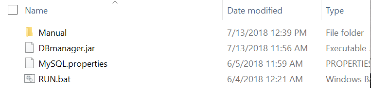
</a>
<ul>
            <li><b>DBmanager.jar</b> - the jar file runs the program</li>
            <li><b>MySQL.properties</b> - mainly contains your MySQL database user name and password</li>
            <li><b>RUN.bat</b> - windows user can double-click the file to run the program</li>
</ul>
<h4>MySQL.properties</h4>
        
It is simply a text file, you can open and edit in any editor. 

        <a href="Manual/screenshots/MySQLproperties.png">
            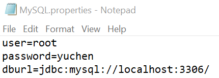
</a>
<ul>         
                <li><b><em>user:</em></b>
                root is the default user name in MySQL database </li> 
                <li><b><em>password:</em></b> As installing the MySQL database in your machine, they will ask you to set the password, then you can input your password in here. </li> 
                <li><b><em>dburl:</em></b> mysql://localhost:3306 is the default port once MySQL database being installed. No need to change that if not necessary. </li>
            </ul>
            <b>Note:</b> Do not leave space between the "=" sign.

<h2>Running the program</h2>
 

            Double-click <b><em>RUN.bat</em></b>. After openning the program, click <b><em>initialize</em></b> to fetch all the schemas in your MySQL database. Select one then go into that one.
        

 <a href="Manual/screenshots/initialize.gif" >
            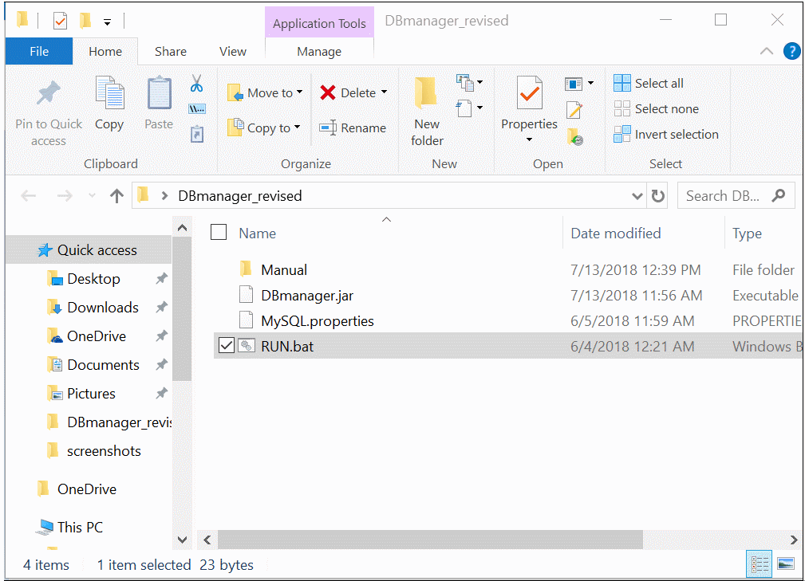
        </a>
        
<b>As you entered your table panel, you will see the buttons below:</b>

        
        <h4>Create new Table</h4>
        <a href="Manual/screenshots/createTableBtn.gif" >
            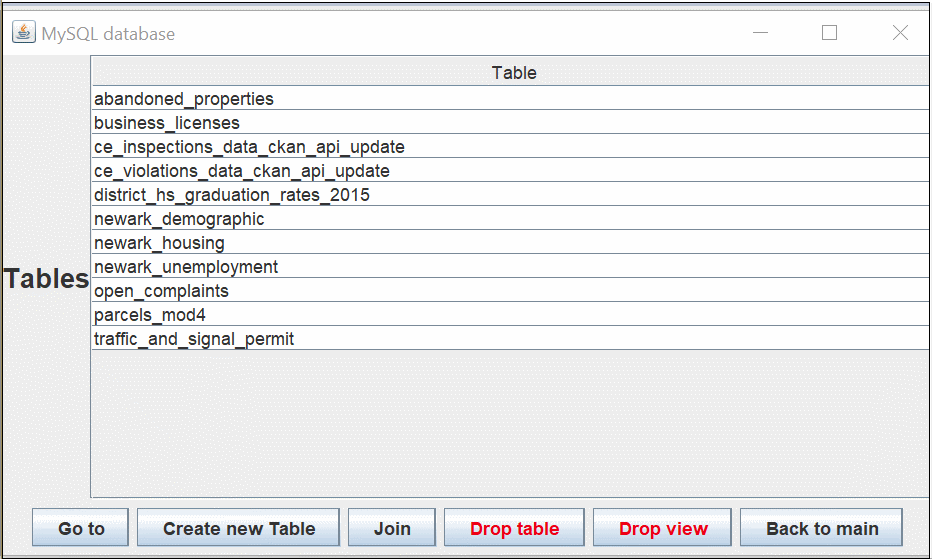
        </a>   
        <h4>Join</h4>
        
        
Join &rarr; Select the tables to be Joined &rarr; select columns to be shown in the join results &rarr; select join type &rarr; view the join results

        
<b>As you entered your data panel, you will see the buttons below:</b>

        
        <h4>Get Lat Lng</h4>
        <a href="Manual/screenshots/getLatLngBtn.png" >
            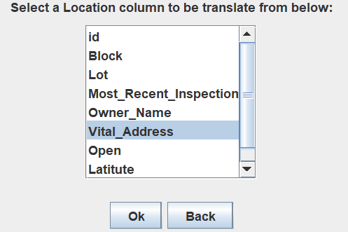
        </a>
        
<b><em>Get Lat Lng </em></b> enable you to retrieve the geometry information Latitute and Longitute from Google server. Select the corresponding <b>address</b> column then click <b>Ok</b>, it will take from few minutes or even longer based on your requests (rows) to google server. 
        Since google server does not accept client side constant requests to increse their server's load, 0.2 seconds interval was added between each requests, therefore it will take long time and please be patient to wait the whole results. 
    
        <h4>Search</h4>
        
In the search panel, column names are autonatically fetched and you can do precise search by directly input the values on the form or range search using predicates. 
        <b>Note:</b> Please leave space between your predicates and values. Predicates supported includes: 
        

        <ul>
            <li>&#x3C;</li>
            <li>&#x3E;</li>
            <li>&#x3C;=</li>
            <li>&#x3E;=</li>
            <li>&#x3C;&#x3E;</li>
            <li>!=</li>
            <li>LIKE</li>
            <li>NOT LIKE</li>
            <li>NOT</li>
            
Upper case and Lower case are both works.  
                An examples are showing below:
            
      
        </ul>
        <a href="Manual/screenshots/SearchBtn.png">
            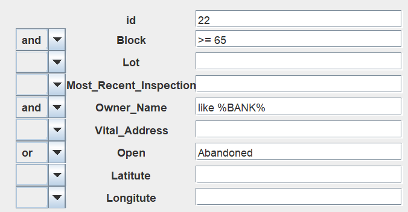
        </a>       
        <h4>Relationships</h4>
        
Pick the column that you want to be referenced like the example showing below:
   
        <a href="Manual/screenshots/relationshipBtn.png">
            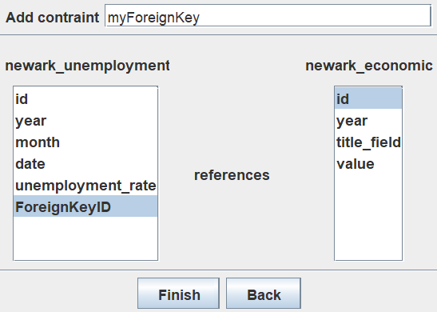
        </a>
        
After clicking <b><em>Finish</em></b>, you can go to the table that <em><b>was referenced</b></em>, click <b><em>Relationships</em></b> again, you can see the current table were referenced by whom, by which column, and what CONSTRAINT is.

        <a href="Manual/screenshots/relationshipBtn2.png">
            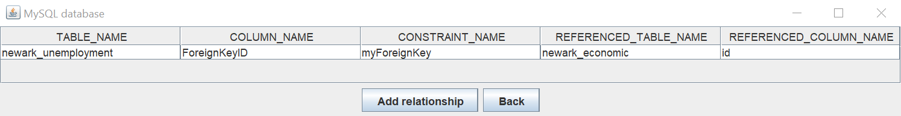
        </a>
        <h4>Visualize</h4>
        
You can click the botton 
            <b><em>Visualize</em></b> in all data panel, could be search query results or join query results. 
            After clicking <b><em>Visualize</em></b> botton, Tableau decktop will pop up. 
        

        <a href="Manual/screenshots/visualize1.png">
            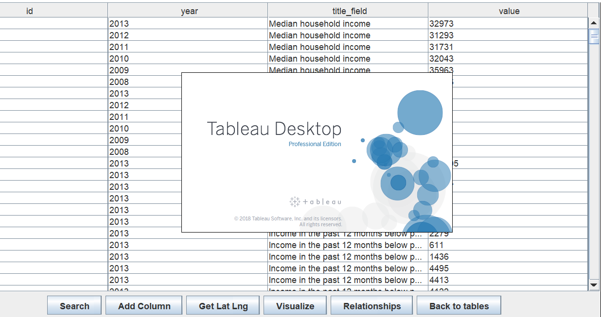
        </a>
        
You need to connect mysql database using password.

        <a href="Manual/screenshots/tableau1.gif">
            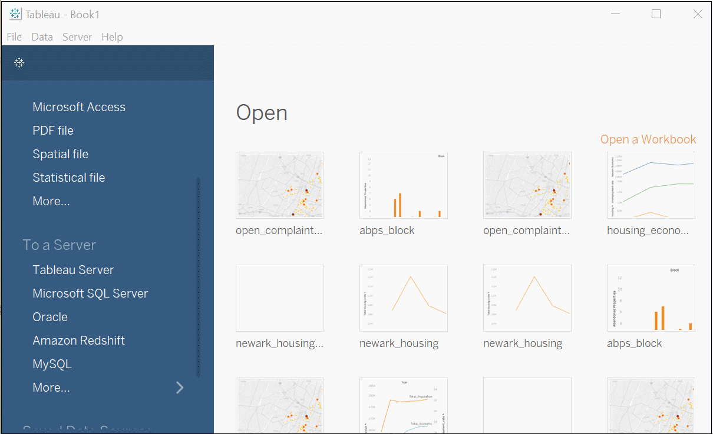
        </a>
        
You can look up the table, or the query results from join or search. 

        <a href="Manual/screenshots/searchResultVis.png">
            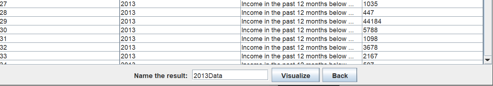
        </a>
        
Join and search queries' results are saved as view, which are also listing in the left side of tableau.

        <a href="Manual/screenshots/searchResultVisTableauSide.png">
            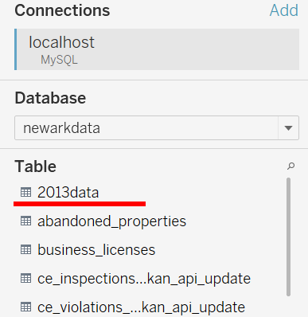
        </a>      
        <h2>Running the Tableau Desktop</h2>
        <h4>Connect to the data source</h4>
        
Whenever you enter the tableau desktop software, the first page is to let you connect the data source. We use MySQL in our program settings, So select <b><em>MySQL</em></b>.

        <a href="Manual/screenshots/TableauInstr0.png">
            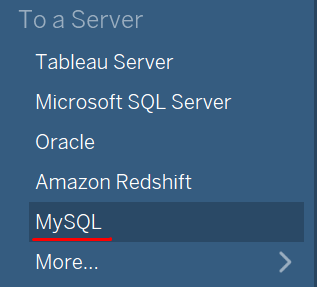
        </a>
        
In the log in panel, localhost, port 3306 and root are all the default settings unless you specifically connect to the database from another server of another machine.

        <a href="Manual/screenshots/TableauInstr1.png">
            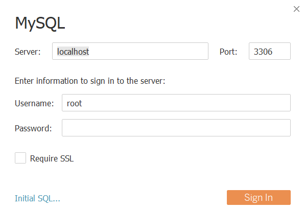
        </a>
        
Choose the Database, then all tables of this database will be listed.

        <a href="Manual/screenshots/TableauInstr1.png">
            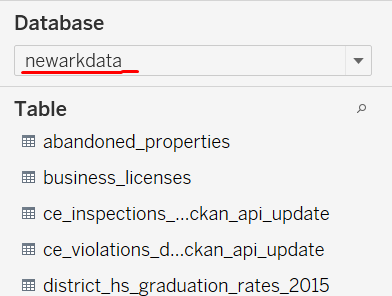
        </a>
        <h4>Plotting with your data</h4>
        
<b>Step 1:</b>  
            use mouse to drag corresponding table into the blank space 
            <b>Step 2:</b> 
            Click <b><em>"Sheet1"</em></b> in the left-down corner to start a new canvas, you can also rename the sheet. 
            <b>Step 3:</b> Drag the corresponding columns into the <b>Columns</b> and <b>Rows</b>. e.g. drag Year into Columns, drag Value into Rows.
        
        
        <a href="Manual/screenshots/TableauInstr3.gif">
            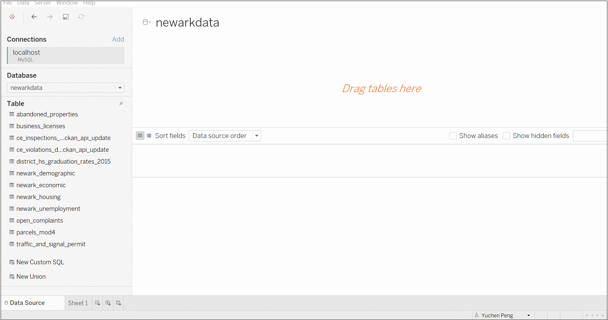
        </a>
